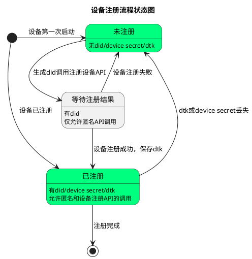
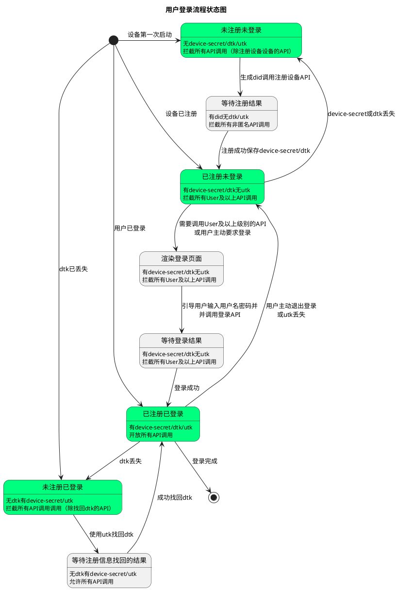
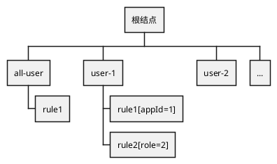
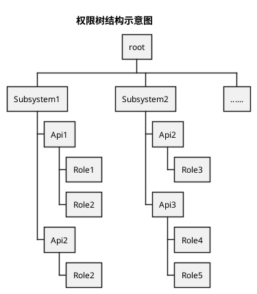
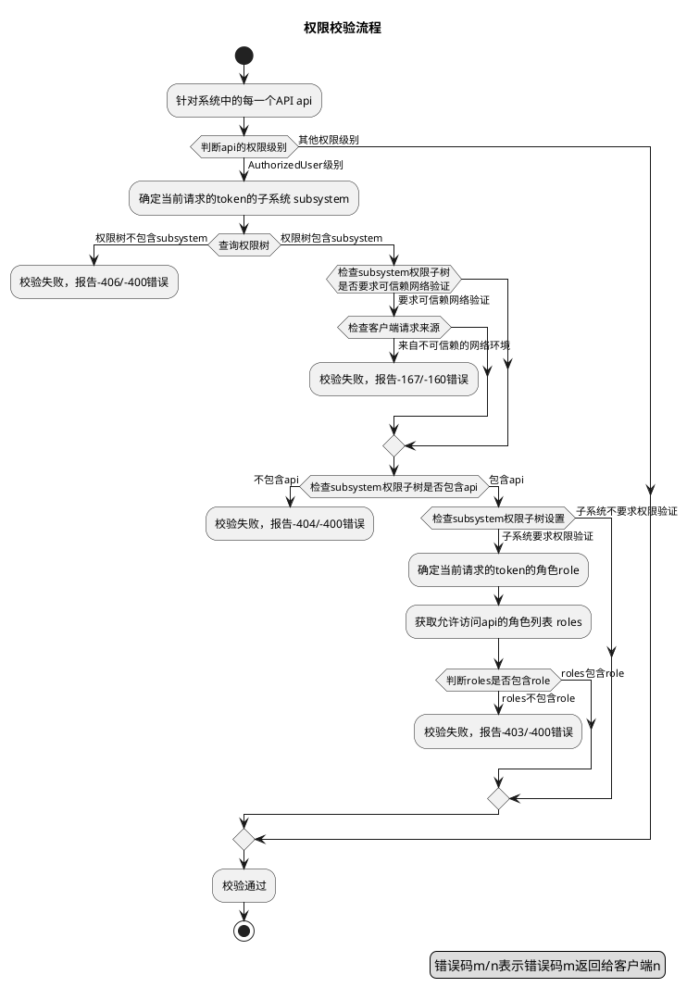
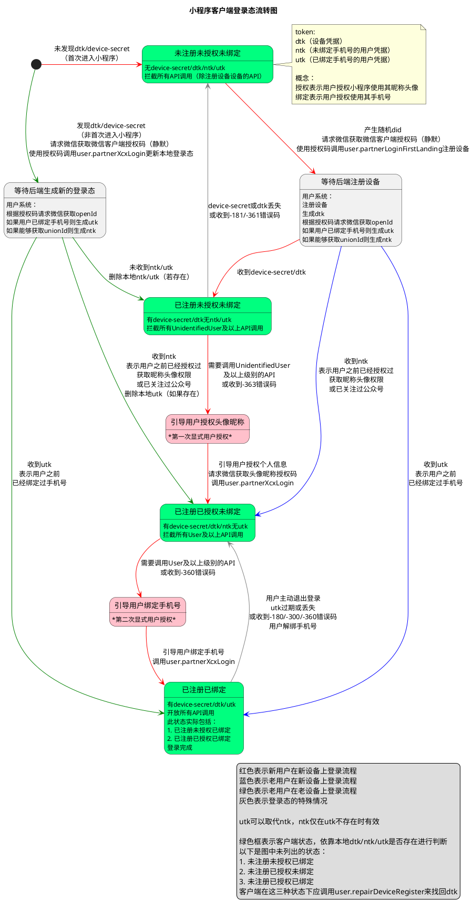

# 5 身份认证与权限验证体系

`API-Gateway+微服务`设计模式的一大特色就时它能很容易实现统一的身份认证和权限验证。因为所有的API请求都必须经过网关处理，所以网关
这里我们可以对每次请求的发起方（客户端）的身份进行认证，以确认它是否有足够的权力访问它需要访问的资源。

如标题所示，身份认证与权限验证体系包含两大块内容：

1. 身份认证，用于确认当前请求的实体（或发起方、客户端）的身份。在目前的网关实现中，身份的含义是设备和用户，表示此次请求从哪里来，
   哪个用户在访问。我们采用一系列的手段来确定请求者的身份，确保不会出现身份冒充的问题。只有解决了"你是谁"的问题，
   解决"你有哪些权限"才有意义
2. 权限验证，在确定访问者身份之后，我们需要再一次确认，当前访问者作为用户a有没有权限访问它正在访问的这些API。权限验证的本质是
   *一个用户能够访问哪些API*的问题（这里我们排除了设备身份，仅考虑使用该设备的用户的权限）。由于用户的巨大数量，以及API的频繁变动，
   我们引入了一系列相关概念用于简化处理权限验证问题，例如用户角色等

在本章节，我们会详细阐述身份认证和权限验证体系的背景、要解决的问题、具体的解决方案以及相关的情景分析。

## 5.1 身份认证与身份凭据

身份认证用于确认当前请求的实体（或者访问者、发起方、客户端）的身份。身份认证的过程就是在解决"*你是谁？*"这个问题。
我们必须采取一系列技术手段，来准确鉴定访问者的身份，并确保不会有伪造身份的事情发生。当然，例如某些大网站曾经出现的
串身份的问题也必须要避免掉。只有准确甄别出了访问者的身份，后续基于这个身份的种种操作（例如鉴权、审计备案等）才有实际意义。

另外，为了保证质量，身份认证应在每次请求的时候进行，这就要求我们需要的认证方案非常轻量，不应成为系统整体性能的瓶颈。

综上所诉，身份认证方案应具备两大特征：*准确*，*快速*。

因此，我们需要寻找一种`准确`、`快速`的身份认证解决方案。经过长期演化，网关采用来所谓的身份凭据方案。
所谓身份凭据（`token`，简称`tk`），指的是由客户端注册设备或者登录之后产生的一种密文的字符串，并在后续的每次网关请求时携带，
网关通过解密该凭据来确认此次请求的访问者身份。为了防止中间人篡改请求信息和伪造请求，网关同时采用了动态盐签名验证机制（见文档第二章节）。

在目前网关的版本中，身份凭据一共有两种：

* 设备凭据，即`device token`，简称`dtk`，是能够代表设备身份的凭据，包含了设备编号、平台信息、凭据有效期等信息。
   客户端在进行设备注册时会获得该凭据
* 用户凭据，即`user token`，简称`utk`，是能够代表用户身份的凭据，包含了访问者所使用的设备编号、平台编号、凭据有效期、用户编号、
   用户角色等信息。客户端成功登录后可以获得该凭据。用户凭据包含了设备凭据的所有信息。客户端在取得用户凭据之后可以忽略设备凭据

身份凭据的生成流程如下：

1. 客户端请求用户系统的设备注册或者用户登录的API（经由网关访问，客户端并不能直接访问后端服务器，sure），
2. 用户系统对对客户端提供的信息进行确认以确定注册或者登录符合规定的要求（例如用户名密码正确、用户未被禁用、设备编号不冲突等）
3. 确认无误后将设备编号、平台编号、用户编号（仅登录）、有效期等信息按照预定义的格式写入到字节数组中（目前采用二进制序列化）
4. 对刚刚得到的字节数组进行`AES`对称加密，得到密文字节数组
5. 对刚刚得到的密文字节数组进行`BASE64`编码，得出密文字符串
6. 根据生成的凭据类型，将相应前缀加入到密文字符串中，其中设备凭据的前缀为`dtk_`，用户凭据的前缀为`utk_`。  
   前缀仅用于方便开发人员区分凭据类型，凭据的解析代码会忽略这些前缀

几个身份凭据的例子：

```text
# 设备凭据
dtk_3saoX3A04pl8OmG9tt0uoXhcZOiQmIF3HmGTWRbhqLFo++kFM4RUoUZVyktzSV6cqVUwX5IM3rS8BuVHvPaZI97D7GfFdwHU+HxQ5DmYVXbGHACEryQ+xJ1xWYOUzWxD

# 用户凭据
utk_FWgaZXL7uh+N/NcFTO4cUii1OBJw0K7fP4BEpMiH9rMJGPW+zE/vpcR4vdcDfKOljLfVIMFwT8408JN+t/0IIU/Ng2Cs1fM90M37vMEzNnRfD8Yx64D/5ftyrFyVKrdlMeU42bspUfqtNCcsmLZBtQ==
```

身份凭据包含以下内容：

| 字段名称 | 字段含义 | 应用范围 | 用途 |
|:---|:---|:---|:---|
| version | 版本号 | dtk/utk | 用于凭据的兼容升级 |
| appid | 凭据所属的平台编号 | dtk/utk | 各平台之间不共享凭据 |
| expire | 凭据的过期时间 | dtk/utk | 用于身份认证和自动续签 |
| deviceId | 凭据所有者的设备编号 | dtk/utk | 不同设备之间不共享凭据 |
| uid | 凭据所有者的用户编号 | utk | 用于鉴定当前用户身份 |
| key | 用于请求签名的动态盐，在签发凭据的时候生成 | dtk/utk | 同一个设备上共存的utk和dtk中的key以及客户端持有的device secret一致 |
| role | 凭据持有人所属的角色 | utk | 用于权限校验 |
| subsystem | 凭据所属的子系统名称 | dtk/utk | 用于校验权限 |
| renewWindow | 凭据过期之后能够续签的窗口期（单位毫秒） | dtk/utk | 用于自动续签 |
| createdTime | 凭据的签发时间 | dtk/utk | 主要用于强制utk过期 |

从技术上说，设备凭据和身份凭据的格式完全一致，在处理上也是不做区分的，其前缀仅用于开发人员区分。与用户凭据相比，
设备凭据缺少了用户编号(`uid`)信息，准确来说设备凭据中的`uid`为0。

客户端在启动时应主动检查是否已经注册（即设备凭据是否存在），并且在未注册设备时自动注册。在访问需要用户凭据的API时，检查本地是否拥有用户
凭据，并在不存在时主动提示用户输入用户名密码（或验证码）进行登录，然后再访问相关API，以防止收到网关提示的权限不足的错误代码。由于用户凭据
包含了设备凭据的信息，客户端应在登录成功之后的所有API请求时，向网关传递用户凭据。

向网关传递凭据可以使用多种方式，目前推荐的是使用通用参数`_tk`，参数值可以是用户凭据或者设备凭据（优先使用用户凭据）。

## 5.2 请求签名与身份凭据的关系

请求签名和身份认证这两个设计相辅相成、互相依赖、缺一不可。

请求签名中的动态盐签名需要使用设备动态盐并在请求时携带设备凭据或用户凭据，网关在对请求进行签名校验时需要用到设备凭据或用户凭据中保存的
动态盐。通过这种机制，网关在身份认证时不仅仅依靠客户端提供的设备或用户凭据，而且验证了客户端拥有此凭据的合法性。只有同时拥有了凭据以及
凭据对应的动态盐的客户端才能被网关认可。

请求签名与身份凭据相结合这种设计方案可以有效避免身份伪造（通过劫持和替换凭据）。理论上来说，只有不怀好意的人同时拿到了身份凭据和相应的
动态盐才能进行身份伪造。因为设备动态盐几乎不在网络上传输，所以有效增加了攻击的难度。如果我们再结合`HTTPS`通信技术，则可以完全避免中间人
攻击。

## 5.3 设备注册

设备注册的目的是为了获取设备凭据，进而可以在后续的通信中使用动态盐进行签名保护。设备注册表面看起来很简单，但由于设备编号和动态盐的问题，
设备注册的过程并不是那么的直接。

下图是设备注册的总体流程，后续我们会对其中涉及的每个细节作详细解释：



### 5.3.1 设备编号

设备注册要求客户端须向服务器提供设备相关信息，而设备相关信息中最终的是设备编号。

设备编号，又称设备号、`device id`、`did`。我们期望为每一个不同的设备设置一个唯一的设备号，以达到用设备号区分不同的设备。通过设备编号，
我们可以跟踪发生在每个设备上的种种行为。简单来说，一个设备号相当于一个手机，不同设备号是不同手机发来的请求。当然由于多平台的出现，同一个
手机的app和浏览器中发起的请求可以被看作来自不同设备的请求，自然设备编号不同。通过跟踪一个特定设备编号在一段时间内的所有请求，可以协助我们
理解该设备上发生的一些行为，并以此解决线上出现的某些bug。

设备编号的另外一个用途便是风控（风险控制）。例如，通过跟踪某个设备上的用户登录、下单发生的频率，我们可以侦测出某些非用户行为（自动刷单等），
并且可以根据相应的设备编号有针对性的禁用某个设备的功能。

根据以上讨论，为了更完整的跟踪设备上发生的行为，对于设备编号，我们有以下两点要求：

1. 每个设备有且仅有一个独一无二的设备编号（`did`）
2. 在一个设备上发出的所有请求都应该携带这个设备编号

### 5.3.2 设备注册过程

为了实现上一节描述的设备编号的两点要求，我们采用了设备注册方案。即设备编号由客户端生成，通过调用设备注册接口进行注册，后端（这里指用户系统）
校验设备编号是否唯一，并根据设备编号生成设备凭据下发给客户端，客户端保存该凭据以证明它已注册该设备并且拥有相应设备编号的所有权。

设备注册过程的具体流程如下：

```plantuml
@startuml
title 客户端设备注册时序图

participant Client
participant "User-Service" as UserService

== 开始注册设备 ===

hnote over of Client: 阻塞所有API调用

activate Client
Client -> Client: 随机生成一个15位整数作为did\n并保存到本地存储
Client -> UserService+: 调用设备注册API\n（携带刚才生成的did作为通用参数）
deactivate Client

== 等待注册结果 ==

hnote over of Client
    阻塞所有非匿名API调用
    其他API调用需要携带did
    使用静态盐签名算法
end note

UserService -> UserService: 检查客户端上传的did是否已被注册
UserService -> UserService: 如果did已经存在，则生成一个新的did
UserService -> UserService: 生成一个随机的设备动态盐
UserService -> UserService: 根据成的device secret\n和最终的did生成dtk\n并保存到设备注册表中

UserService -> Client-: 返回生成的dtk和device secret
activate Client

== 设备注册成功 ==

Client -> Client: 保存dtk、device secret和did到本地存储
deactivate Client

hnote over of Client
    开放设备注册级别的API调用
    后续API调用携带此dtk
    使用动态盐签名算法
end note
@enduml
```

1. 设备编号由客户端随机生成  
   客户端在启动时（app启动或者h5页面渲染阶段，在发起所有API请求之前）检查本地存储中是否包含设备编号信息，如果不包含，
   则生成一个15位长的随机整数（非0开头），并将其存储到本次存储中，以防止重复生成
2. 客户端后续所有的请求都需要携带来自上一步骤生成的或者从本地存储中获取的设备编号，作为`_did`通用参数
3. 客户端调用用户系统提供的注册设备API（通过网关调用，sure）
4. 用户系统查重  
   为了防止随机生成导致的设备号冲突，用户系统须检查其携带的设备编号是否已经注册（通过维护一张设备注册表来实现）。如果该设备编号已经存在，
   则用户系统会尝试再随机生成一个未注册的设备编号，并用这个新的设备号取代客户端提供的设备号。将客户端提供的设备编号或者用户系统生成的
   新设备编号注册到所谓的设备注册表中。
5. 用户系统根据上一步骤确定的设备编号生成并返回给客户端如下信息：
   1. 最终的设备编号（客户端提供，或者在冲突时由用户系统重新生成）
   2. 随机生成签名验证用到了动态盐，即`device secret`
   3. 设备凭据，即`device token`（内部包含了最终的设备号和动态盐）
6. 客户端收到用户系统返回的注册成功的返回值，并更新本地的设备编号、保存动态盐`device secret`和`device token`
7. 后续API请求都应该使用上一步得到的`device secret`进行动态盐签名，并携带设备编号和`device token`

如你所见，上述流程能够很好工作的前提是，客户端每次随机生成的设备编号都应该是唯一的。很明显，除非你是第一个生成设备编号的客户端，否则你生成
的随机数总是存在一定概率和设备注册表中的设备编号冲突（即重复）。虽然我们有冲突修正方案（例如步骤#4），但是对于客户端来说，由于设备注册是
一个异步过程，在设备注册成功返回之前的这段时间内，其他的API请求可能已经发出并且处理，它们携带了客户端早期生成的设备编号。如果客户端在
收到设备注册成功的返回值时发现后端提示它设备编号因为冲突而被指定了一个新的编号，这是它才意识到刚刚发出的那些API请求使用了其他设备的设备号，
即出现了设备号串号问题，但此时已为时已晚。后端服务在跟踪一个被串号（因为冲突导致某个设备短时间内使用了这个设备的设备号）的设备时，
会无法避免地将其他某个设备上发生的短时行为包括进来，对设备行为分析造成干扰，并且无法排除。

当然，也不用太沮丧，因为大部分情况下设备注册所花费的时间不是很长，一般1s可以结束，并且绝大多数情况下设备编号不会冲突（对于一个拥有一千万设备
注册量的系统，生成一次15位随机数产生冲突的概率大概为`0.00000001`），而且设备注册一般只发生在新设备上，频率不是很高，所以设备串号情况发生
的概率很小。退一步讲，即使存在某些设备串号的情况，由于量少，对我们对设备行为分析产生的干扰也不是很显著。

实际上，我们有一个办法解决这个问题，就是将所有API的访问（当然，除了设备注册的API）推迟到设备注册成功返回之后，并使用最终确定的设备编号。
但是这样会增加客户端启动的复杂度，引入更多的不确定性。如果设备注册由于各种原因出现问题，或者网络或其他原因导致延迟，客户端的启动效率
大大降低，影响可用性和用户体验。所以经过权衡后，我们最终选择容忍这种设备串号的情况。

### 5.3.3 客户端设备信息的丢失和不一致

根据上一节的讨论，我们大致解决了设备身份认证的问题。但是按照以往的惯例，计算机系统总是会设计一些问题等着我们去处理。而现在这个问题便是
客户端设备信息不一致。

由于某些已知或未知的原因，保存在客户端的设备相关的信息会部分或全部丢失或损毁。全部丢失可以看作是新设备，按照新设备重新注册流程即可。
现在我们详细讨论以下部分丢失或损毁的情况。

设备信息主要包括：

* 设备编号（`did`）
* 动态盐（`device secret`）
* 设备凭据（`device token`）

我们讨论以下有关设备信息部分丢失的情况：

1. 仅设备编号丢失  
   在这种情况下，客户端可以进行正常的动态盐签名，但是通用参数`_did`无法提供。由于客户端能够提供有效的`device token`，并且能够使用
   `device secret`进行动态盐签名以验证身份。所以用户系统可以提供一个API来协助客户端找回丢失的设备编号，从而从信息缺失的状态中恢复。
   客户端在找回设备编号的这段时间内发起的所有请求都不应该携带设备号（即不提供`_did`通用参数）。如果不能在短时间内找回设备编号，客户端
   需要清理所有设备有关信息，并重新注册设备（包括生成新的设备编号）。
2. 仅动态盐丢失  
   在这种情况下，客户端无法进行动态盐签名，但是根据第二章节有关签名流程的讨论，客户端在访问匿名请求时可以降级到静态盐签名。
   所以在动态盐丢失的这段时间内，它可以自由访问匿名API，但是根据签名流程的规定，它不能向网关传递设备凭据，即`device token`。
   出于安全上的考虑，用户系统不应该提供任何API来协助客户端找回动态盐（`device secret`），所以在动态盐丢失的情况下，客户端没有任何办法
   恢复。因此，客户端在发现这种情况时清理掉其他设备信息并重新注册设备（包括生成新的设备编号）
3. 设备凭据丢失或设备凭据和动态盐同时丢失  
   在这种情况下，客户端需要清理掉动态盐（如果存在）和设备编号，并重新注册设备（包括生成新的设备编号）。清理设备编号并重新生成的原因是，
   因为该设备编号已经注册。使用之前的设备编号会让用户系统认为这是一次设备编号冲突，并为此提供一个新的设备号。尽管这个设备号曾经属于这个
   设备，但是由于缺乏必要的凭据，它已经丧失了对这个设备号的拥有权

接下来我们考虑设备编号设备动态盐和设备凭据之间的关系。从设计的角度看

```text
设备凭据(device token) = 设备编号(did) + 设备动态盐(device secret)
```

设备凭据的明文形式包含了设备编号和动态盐。网关正是通过对设备凭据的解析来确认客户端签名时使用的动态盐。实际上，这三者的冗余设计是设备身份
认证的根本思路。目前身份校验并没有包含设备信息，但是理想情况应该需要将其包括进来，网关在校验身份时有必要对比通用参数中的设备编号和
设备凭据中的设备编号。同样，网关根据签名匹配来判断客户端同时拥有正确的设备动态盐。

因此，如果设备编号或者设备动态盐因为某些原因发生了变化，而设备凭据却没有相应改变，则意味着客户端设备信息出现了不一致。

根据以上讨论，设备信息不一致包含以下两种情况：

1. 设备编号和设备凭据不一致（即和设备凭据中的设备编号不一致）  
   目前网关没有验证这种不一致，所以客户端无法察觉这种不一致现象的存在。但是这种不一致会导致设备行为分析出现异常。未来，网关会提供一套解决
   方案来通知并协助客户端找回设备编号
2. 设备动态盐和设备凭据不一致（即和设备凭据中的设备动态盐不一致）  
   如果客户端向网关发起的请求使用的是动态盐签名，则网关通过签名验证可以发现这种不一致，并返回客户端错误码（`-181`）告知客户端设备凭据
   和设备动态盐不一致。客户端收到这个错误码后应清除动态盐（`device secret`）、设备凭据（`device token`）和设备编号（`did`）并重新
   生成设备编号和注册设备（和设备凭据或设备动态盐丢失的处理方式一致）

除了上面讨论的设备信息丢失或者不一致情况之外，我们还可能会遇到另外一种情况。前面提到过，在生成设备编号（新设备、或设备信息丢失、不一致）
之后，客户端会调用注册设备的API进行设备注册，在此期间，其他的API可以正常发出（携带刚刚生成设备编号）。但是如果这些发生在设备注册成功之前的
API调用中如果碰巧出现了非匿名API（例如安全等级是已注册设备等）则网关会反馈给权限不足（`-160`）错误码。因此，客户端需要延迟所有非匿名的
API请求，直到设备注册成功。或者在客户端设计的的时候减少早期启动时对非匿名API的调用。

## 5.4 用户登录

设备注册是一个自动的、用户无感知的过程，而用户登录则需要用户的直接介入。用户登录用于帮助系统认证当前访问者的身份，这里的访问者指的是使用
系统的终端用户（人），而不是计算机系统中的设备。在本文档中，"用户"指的是"人"，而设备指的是手机、台式机等物理实体。

用户登录的总体流程图如下：



在本节，我们详细讨论用户登录和用户凭据相关的问题。

### 5.4.1 用户注册和用户编号

和设备注册相对应，用户登录也涉及到一个编号，叫用户编号，或`user id`、`ud`。每个用户拥有一个独一无二的用户编号。和设备编号不同的是，用户
编号是在用户注册的时候由用户系统主动分配的，由系统保证唯一性。另外用户编号也不需要在每次请求的时候传输。

用户注册的过程和设备注册过程类似，区别是，用户注册由用户主动发起（而不是设备）或者由后台系统预先生成，或者在第一次登录的时候自动创建。

用户注册为每个用户分配一个唯一的编号（一般为整数），并在用户注册表中创建一条记录，用于存储用户在注册时提供的用户信息。

### 5.4.2 用户登录过程

客户端将用户提供的用户名和密码（或验证码）提交给用户系统（经由网关），用户系统验证用户名密码的合法性，并在验证通过后返回给客户端用户凭据。

用户凭据用于证明用户身份，表明此客户端曾经正确提供过合法的身份证明信息（用户名、密码），属于可信赖的访问者。用户凭据是我们进行用户身份验证
的主要手段。参考第五章开头时的关于用户凭据和设备凭据的探讨，我们需要在用户凭据中包含身份凭据的信息，因此，客户端在进行用户登录之前需要
成功注册设备，并在用户登录时提供设备凭据。

> 用户登录涉及到用户系统相关的一些细节，但这些细节不是这篇文档的重点，如有兴趣，可以参考用户系统相关的文档。

用户登录的过程如下：

```plantuml
@startuml
title 客户端用户登录时序图

actor User
participant Client
participant "User-Service" as UserService

== 开始注册设备 ===

hnote over of Client: 阻塞所有API调用

activate Client
Client -> Client: 随机生成一个15位整数作为did\n并保存到本地存储
Client -> UserService+: 调用设备注册API\n（携带刚才生成的did作为通用参数）
deactivate Client

== 等待注册结果 ==

hnote over of Client
    阻塞所有非匿名API调用
    其他API调用需要携带did
    使用静态盐签名算法
end note

UserService -> UserService: 检查客户端上传的did是否已被注册
UserService -> UserService: 如果did已经存在，则生成一个新的did
UserService -> UserService: 生成一个随机的设备动态盐
UserService -> UserService: 根据成的device secret\n和最终的did生成dtk\n并保存到设备注册表中

UserService -> Client-: 返回生成的dtk和device secret
activate Client

== 设备注册成功 ==

Client -> Client: 保存dtk、device secret和did到本地存储
deactivate Client

hnote over of Client
    开放设备注册级别的API调用
    后续API调用携带dtk
    使用动态盐签名算法
end note

...

== 开始登录 ==

Client -> Client: 渲染登录页面
activate Client
User -> Client: 输入用户名和密码
Client -> UserService: 调用登录API
deactivate Client

== 等待登录结果 ==

hnote over of Client
    阻塞User及以上级别的API调用
end note

UserService -> UserService: 校验用户名和密码
UserService -> UserService: 根据客户端提供的dtk生成utk\n（保持动态盐不变）
UserService -> Client: 返回生成的utk

activate Client
== 用户登录成功 ==

Client -> Client: 保存utk到本地存储

deactivate Client

hnote over of Client
    开放User及以上级别的API调用
    后续API调用携带utk
end note
@enduml
```

1. 准备阶段：  
   客户端生成设备编号（如果不存在），并成功注册设备（如果未注册）
2. 客户端弹出登录表单供用户输入用户名和密码（手机验证码登录相关的实现细节请参考用户系统文档）
3. 客户端调用用户系统的登录API（经由网关），并提供用户名、密码、设备编号以及设备凭据  
   为了获取有效的设备凭据，用户系统的登录API的接口权限应设置为`已注册设备`
4. 网关收到请求后对请求进行签名校验，并将用户名、密码、设备编号、设备凭据中的动态盐作为参数传递给用户系统的登录API
5. 用户系统对用户名和密码进行校验，确认该用户是否存在已经是否允许登录，如果校验失败，则返回给客户端相应错误。
6. 如果通过所有检查，用户系统则生成并返回给客户端用户凭据。  
   根据客户端提供的设备凭据中的动态盐和设备编号，加上根据用户名查出的用户编号，生成最终的用户凭据。即：

   ```text
   用户凭据（user token） = 设备编号（did） + 设备动态盐（device secret） + 用户编号（uid）
   ```

7. 客户端收到用户登录成功的返回值，将得到的用户凭据保存到本地缓存中，后续所有的请求都应携带这个用户凭据（通过通用参数`_tk`）

因为用户凭据中包含了和设备凭据中一样的动态盐，并且这个动态盐和本地保存的设备动态盐（`device secret`）一致，所以将用户凭据传递给网关
可以继续通过网关的签名校验。

客户端应尽可能使用用户凭据，而不是设备凭据。因为用户凭据不仅包含了设备凭据的所有信息，还提供了额外的用户相关的信息，例如用户编号（`uid`）。
这个信息可以帮助我们实现对一个特定用户的行为跟踪和分析，而不是设备。因为用户凭据中同样包含了设备编号，所以一次请求中会同时包含`uid`和
`did`，所以通过对这两个参数的利用，我们可以分析用户在设备上的行为，例如一个用户一共在哪些设备上活动，一个设备上一共发生了哪些用户的活动。
风险控制系统可以利用这一点侦测一个用户短时间内在多个设备上刷单，或者多个用户在同一个设备上刷单等不正常行为。

### 5.4.3 用户凭据丢失或和设备信息不一致

很不幸，和上一节关于设备信息丢失或不一致的问题一样，用户凭据也存在丢失或和设备信息不一致的可能（only gods knew what happened）。

用户凭据的丢失。这种情况比较简单，因为用户是否登录完全由用户凭据的存在与否来判断，所以用户凭据的丢失可以简单理解为用户处于未登录状态。但是
要注意的是，客户端不应及时提醒用户需要登录，仅在必要的时候（例如不得不访问一个只有登录用户才能访问的API）引导用户登录。

本文后面部分会讨论用户凭据过期的设计，这种情况和用户凭据丢失是等效的。

相比之下，用户凭据和设备信息不一致就比较复杂了，我们分情况讨论：

1. 设备编号丢失  
   设备编号丢失会导致客户端请求网关时无法携带通用参数（`_did`)，虽然能够正常工作，但是会导致网关的API调用日志中缺失设备编号，导致对设备
   行为分析出现问题。未来，网关或用户系统应该提供协助客户端找回设备编号功能，从而客户端可以从信息缺失的状态中恢复。客户端在找回设备编号的
   这段时间内发起的所有请求都不应该携带设备号（即不提供`_did`通用参数）。如果不能在短时间内找回设备编号，客户端需要清理所有设备有关信息，
   并重新注册设备（包括生成新的设备编号）
2. 设备编号和用户凭据中的信息不一致（即和用户凭据中的设备编号不一致）  
   目前网关没有验证这种不一致，所以客户端无法察觉这种不一致现象的存在。但是这种不一致会导致用户或设备行为分析出现异常。未来，网关会提供
   一套解决方案来通知并协助客户端找回设备编号
3. 设备动态盐丢失  
   在这种情况下，客户端无法进行动态盐签名，但是根据第二章节有关签名流程的讨论，客户端在访问匿名请求时可以降级到静态盐签名。
   所以在动态盐丢失的这段时间内，它可以自由访问匿名API，但是根据签名流程的规定，它不能向网关传递设备或用户凭据。并且，出于安全上的考虑，
   用户系统不应该提供任何API来协助客户端找回动态盐（`device secret`），所以在动态盐丢失的情况下，客户端没有任何办法恢复。因此，客户端
   在发现这种情况时清理掉其他设备信息和用户信息并重新注册设备（包括生成新的设备编号）
4. 设备动态盐和用户凭据不一致（即和用户凭据中的动态盐不一致）  
   如果客户端向网关发起的请求使用的是动态盐签名，则网关通过签名验证可以发现这种不一致，并返回客户端错误码（`-180`）告知客户端用户凭据
   和设备动态盐不一致。客户端收到这个错误码后应清除用户凭据（`user token`），并在下一次访问用户权限级别的API时提醒用户重新登录
5. 设备凭据丢失  
   在有用户凭据的情况下的设备凭据丢失并不会影响客户端的正常执行，客户端依然可以使用设备动态盐进行动态盐签名，以及使用用户凭据执行API调用。
   但是我们仍然需要从这种丢失状态下恢复回来。用户凭据可能会在用户主动注销登录和用户凭据失效时被清理，如果在这之前设备凭据没有找回，那么
   我们会陷入无凭据可用的情况，而不得不重新注册设备。找回的方法也比较简单，调用用户系统提供的根据用户凭据生成设备凭据的API，API仅允许
   登录用户访问。

其他情况可以归属于上节讨论的设备信息丢失范畴，可以按照之前讨论的办法处理。

## 5.5 注销登录

注销登录是客户端的一种主动行为，以期待客户端和服务器清除他的登录信息。用户在注销登录之后可以重新登录这个账号，也可以登录其他账号。在一些
权限系统的实现中，权限的变更需要重新登录才能生效。注销登录的另外一个用处便是解决一些棘手的线上问题（和Windows的重启类似）。

注销登录对系统的要求是：清除之前登录留下来的各种登录信息，使之恢复到登录之前的状态。按照网关对登录流程的设计，所谓登录信息指的是用户凭据。
所以，客户端在收到用户的注销登录事件之后，应清理掉用户凭据。

注销登录中被注销的是用户凭据（`user token`），过程和用户登录相反。设备凭据是自动获取的，设备注销的意义不大。

按照上一节关于凭据丢失或信息不一致的讨论，如果用户在注销登录时设备凭据已经丢失，则应清理掉所有设备信息（设备编号、设备动态盐）并重新初始化、
注册设备。为了减少设备编号的变更次数，客户端应主动避免陷入这种状况。

为了满足一些业务需要（例如定向推送），后端服务记录了用户的登录状态和登录时所使用的设备，即所谓的账号-设备绑定。用户的注销登录行为需要汇报给
服务端让其及时地对账号-设备进行解绑。所以客户端在处理注销账号时应使用这个用户凭据调用注销登录的API（`logout`），通知服务端执行相关的清理
动作。

有一种情况需要考虑：如果此时用户凭据已经过期，则网关会直接拒绝此次请求，并返回客户端凭据已过期的错误码（`360`）。客户端在收到该错误码时
主动删除用户凭据，整体流程不受过期的影响。但是用户系统那边会由于凭据过期导致错过了解绑账号-设备的机会，从而会继续向那个已经被注销账号了的
设备推送信息，导致非期待行为的发生。可以采用以下方案解决这个问题：

用户系统在绑定账号-设备信息（用户登录）时，设置一个和其签发的用户凭据中的过期时间一致的定时器，并期待在用户凭据过期时在服务端自动触发
注销账号的清理过程（即解绑）。在下文介绍的凭据自动续时，更新这个定时器，使之始终与客户端的凭据的有效期保持一致。这种办法的优点是：
使解绑过程不依赖于客户端的注销汇报功能，使得这个清理流程相比于之前的方案更加稳定可靠。

## 5.6 凭据过期与自动续签（renew-token）

身份凭据中包含了一些有时效性的信息。例如，用户凭据中包含了用户编号、用户角色、凭据签发的目标子系统等信息（详见后续章节）。换句话说，因为
性能上的考虑，用户凭据中不仅包含了必须的用户身份认证相关的信息（用户编号、设备编号、动态盐），还包括了其他的类似于登录会话的信息。
这使得用户凭据更像是一个会话身份凭据（`session token`），用户在切换大系统内的各个子系统时，系统应提供平滑无感知的凭据切换支持
（即`SSO`）。

由于设备凭据能够自动生成和获取，并且不包含失效信息，所以这里我们主要讨论用户凭据。

由于用户凭据中携带了用户相关的一些可变信息，例如角色。如果一个用户的角色被编辑，那么这个用户所有的凭据都包含了错误的数据。因此凭据需要有
过期机制，来尽可能及时地更新这些过期数据。凭据过期还可以用于避免一个已经被删除或者关闭的账户的凭据长时间访问系统。

永不过期的凭据对系统安全来说也是个威胁。拥有一个凭据就相当于你拥有了一个永久有效地通行证，为攻击者提供了潜在地攻击方法。

网关为凭据过期提供了三个方面的支持，我们一一进行讨论。

我们先通过一张流程图理解凭据过期与自动续签的流程：

```plantuml
start
if (utk expired but in renew window?) then (expired but not too late)
    :renew-user-token;
    note right
        调用续签utk的API进行续签
        并将续签后的新的utk设置会请求上下文
    end note
endif
:check-user-expire-token-tree;
note right
    检查utk过期树
end note
if (utk should be expired) then (should be expired)
    if (renew before expire) then (need renew)
        :renew-user-token;
        note right
            调用续签utk的API进行续签
            并将续签后的新的utk设置会请求上下文
        end note
    else
        :force-utk-expire;
        note right
            强制将utk的过期时间设置为已过期
            并将utk过期树中给定的过期原因设置到请求上下文中
            这种设置会在后续步骤中被检查出来
        end note
    endif
endif
if (user token expired?) then (expired)
    :degrade-utk-to-dtk;
    note right
        设置请求上下文中的caller(tk)字段：
        * uid=0
        * role=null
        并设置请求上下文中的userTokenExpired为true
    end note
    if (utk required?) then (required)
        :determine-expire-reason;
        note right
            从请求上下文中查找本次utk过期的原因
            并以此作为错误码返回给前端
        end note
        :reject;
        detach
    endif
endif
stop
```

### 5.6.1 身份凭据过期时间

身份凭据包含一个过期时间的字段（`expire`），用于表示此凭据将在这个*时间点*过期。网关在每次处理请求时，会检查身份凭据是否过期，将其中的
`expire`字段和当前时间进行对比。如果凭据被判定过期，网关会尝试续签（参考下一节），如果不能续签或续签失败，则报告凭据过期（服务端错误码
`-300`【token过期】，客户端错误码`-360`【token无效】），并终止此次请求的处理流程。

过期时间由用户系统在签发身份凭据的时候指定。用户系统可以根据要签发的凭据类型、签发的目标对象、签发的原因等签发不同有效期的凭据：对于设备
凭据，有效期可以尽可能长；终端用户（最终用户而非后台使用人员）的身份凭据可以稍长一点；而对于内部用户（运营、客服等），由于其权限重要、
影响面广，则有效期应该尽可能短。

用户系统应主动利用他所签发的身份凭据及其过期时间。用户系统需要记录它所签发的每个身份凭据及有效期，并在有效期结束时主动执行相关的清理动作。
用户系统需要了解目前有多少活跃的身份凭据。如果因为系统内数据更新（例如删除用户、编辑用户角色等）导致某些凭据失效，那么用户系统需要提供
所有这些需要失效的凭据，并利用下一节提到的强制过期功能使之失效。

### 5.6.2 身份凭据的自动续签

从安全的角度考虑，签发的身份凭据有效期不应过长，但是过短的凭据有效期会导致更加频繁的登录。但是根据往常经验，频繁登录会显著降低系统的用户
体验和使用便捷性。如何在安全和便捷上作权衡就显得很重要，是牺牲便捷性保证安全？还是牺牲安全性来成全便捷和用户体验？

我们选择了另外一条路：身份凭据自动续签。

自动续签指的是，在身份凭据过期的一段时间内，系统自动使用该凭据换取一张拥有新的有效期的凭据。这种设计方案不只存在于网关中，而是在生活中的
各个方面。社会生活中用到的很多证件都支持续签（例如驾驶证），新申领的过程很繁琐，但是续签的流程比较简单。续签流程的引入大大简化了一些可以
避免的冗余流程，在保证安全的前提下增加了灵活性。网关的身份凭据自动续签正是采用了这一设计思路。更进一步，网关的身份凭据续签是自动的，全程
不需要用户干预。

身份凭据包含了一个叫做`renewWindow`（续签窗口期）的字段，单位毫秒，指示网关在此凭据过期的多长时间内内可以续签它。续签窗口期的默认值为0，
表示凭据默认不能续签。用户系统在签发凭据时应根据签发的凭据类型、签发的目标对象、签发的原因以及待签发的凭据的有效期来设置续签窗口期。

> 注意：续签窗口是一个时间长度（单位毫秒），而过期时间是一个时间点（自1970/1/1零点年以来的总毫秒数）

合理的设置凭据的过期时间和自动续签的窗口期可以同时获得很好的安全性和便捷性。例如，如果设置有效期是一天、续签窗口期一个月，则此凭据会被每天
续签一次（如果用户在这一天有访问），直到用户在一个月内没有任何访问记录，那时凭据会错过最后的续签机会，从而彻底失效。

由以上讨论可知，身份凭据的失效实质上包括两个阶段，第一个阶段是失效但可以续签，第二个阶段是失效且无法续签。我们可以得到如下等式：

```text
凭据最终失效时间 = 凭据失效时间 + 凭据续签窗口
```

客户端在凭据的最终失效时间之后使用它访问系统会被拒绝，这一点和引入续签之前的逻辑一致，但是不同的是，因为续签过程可以持续延长凭据的有效期，
所以如果客户端保持一定的访问频率，则它可以避免所谓的最终失效宿命。这种设计本质上保证了那些活跃用户的用户体验，而对于不活跃用户，偶尔登录
一次系统也在可接受范围内。

网关在处理每次请求时，会检查该请求携带的凭据是否需要续签，并在需要续签时调用相应的API进行续签，使用老的凭据换取新的凭据，新老凭据的内保存的
的信息应保持一致，用户编号、设备编号、动态盐应保持不便，过期时间应在当前时间之后，其他信息可以根据待续签用户的实际情况进行更新。

用户系统有权拒绝续签。用户系统在接收到续签请求时，应根据用户编号查询该用户的最新信息，并决定是否要对其进行续签。如果续签遭拒，网关会向
客户端报告`-360`身份凭据错误（在网关日志中，这个错误码是`-300`），并终止此次请求的处理。

如果续签成功，网关会将新的身份凭据写回到请求的响应中，以期待客户端使用新的凭据替换掉本地的已经过期的凭据，并在后续的请求中使用这个信息的
凭据。参考第二章节有关返回值的定义，续签后的新的凭据保存在`Response.newUserToken`中。

注意，用户提供的续签API不应只是简单地修改凭据的过期时间，它需要核对待续签的凭据的所有人（用户）是否被冻结、是否存在、账户是否存在问题、
角色是否发生改变等信息。简单来说，一次续签可以理解为一次自动的无密码登录。

通过凭据续签，我们可以实现最终的凭据信息更新，使凭据内保存的数据的延迟时间不超过一个可控的时间范围（凭据的有效期）。如果凭据有效期为一天，
则凭据内的信息的延迟不会超过一天。换句话说，如果你删除了一个用户，那么这个用户的凭据最晚会在第二天全部失效。如果需要更高的时效性，可以考虑
缩短凭据的有效期（加快续签的频率）或者采用下一节提供的方案 - 身份凭据强制过期。

### 5.6.3 强制过期支持

强制过期指的是网关提供的一种有针对性的实时过期机制。所谓强制过期，指的是业务系统告知网关哪些用户凭据从现在开始应视为已过期的凭据，不再具有用户凭据的功能。

强制过期有以下用途：

1. 用户角色发生改变，主要应用于权限降级（从高级别调整为低级别）或者权限转移（从一个权限调整为另一个权限）
2. 单设备登录支持  
   单设备登录指的是，一个用户在某个时间点只能在一个设备上登录，当用户从一个设备转移到另外一个设备时，为之前设备签发的用户凭据应强制失效。
   用户系统在处理登录请求时，强制过期掉之前签发给这个用户的所有用户凭据。其他设备应在收到权限强制失效时给出友好的提示。网关允许在强制过期凭据时指定过期原因，并在强制过期时将此信息发送给客户端，以此来区分不同类型的强制过期
3. 设备黑名单。通过强制过期签发给某个设备的所有凭据，达到屏蔽一个设备的目的
4. 其他所有需要更新用户凭据信息的场景
5. 用户修改密码
6. 内部实现调整，需要针强制过期某些类型的用户凭据

在了解了强制过期的用处之后，我们开始介绍业务系统如何强制过期某些凭据。

从概念上说，网关可以接收一组关于凭据的过期规则，所有满足过期规则的凭据都被视为需要强制过期的凭据。

强制过期的核心问题是：*哪些凭据需要过期*。基于这一点考虑，我们引入了*凭据过期规则*概念。

凭据过期规则通过描述凭据的某些特征来表达哪些凭据需要过期，例如

* 所有今天之前签发的凭据全部失效
* 所有角色为1的凭据全部失效
* 所有之前签发给app平台签发的所有凭据全部失效
* 所有针对某个子系统签发的所有凭据全部失效

过期规则的定义如下：

```plantuml
class UserTokenExpireRule {
    在规则命中时，网关应采取的措施，续签token，还是报告客户端错误
    ExpireReason reason
    ....
    根据token的签发时间是否早于给定时间判断是否过期
    long beforeTime
    ....
    根据token的appId判断是否过期
    Integer appId
    ....
    根据token的subsystem判断是否过期
    String subsystem
    ....
    根据token的角色判断是否过期
    String role
    ....
    根据特定token进行判断是否过期
    String token
}
```

如上所诉，一个过期规则可以指定多个条件，例如签发时间必须早于某个时间点、子系统为某个指定的值等。这些条件必须同时满足才
算满足这个规则。换句话说，一个规则中的所有条件之间是且的关系。

针对一个特定用户，我们可以指定多个过期规则，这些过期规则之间是或的关系，即满足任何一个规则的凭据都会被强制过期。

网关在判断一个凭据是否需要强制过期时，会根据凭据中的用户编号找到设置给这个用户的所有过期规则，按照定义的顺序依次匹配，
如果匹配成功，则判定此凭据过期，并使用导致其过期的过期规则中定义的过期原因，决定下一步的操作。

每个过期规则都可以指定过期原因（默认值为报告客户端凭据已过期），过期原因中包含以下内容：

* `type`  
  过期类型，目前可选值为：
  * `EXPIRED` 过期，用于一般的过期原因，返回`-360`错误码给客户端，网关日志中报`-301`
  * `SINGLE_DEVICE` 单设备，用于单设备登录功能，返回`-310`错误码给客户端
* `message`  
  额外返回给客户端的信息，客户端可以使用此信息进行更友好的提示
* `tryToRenew`  
  布尔值，用于表示在报告错误之前，是否尝试renew token，仅在renew失败后向客户端报告错误

其中`tryToRenew`可以用于实现所谓的*强制自动续签凭据*的功能，一般用于在用户无感知的情况下自动更新特定用户的凭据，例如用户角色的变更。

网关提供两种过期规则的设置方式：

* 针对特定用户  
  可以为一个用户指定多个过期规则
* 针对所有用户  
  可以为所有用户指定多个过期规则。这种用法的影响面比较广，但是有其特定的应用场景，比如强制下线拥有有个角色的所有用户的
  凭据等

网关使用所谓的`凭据过期树`来组织所有的这些过期规则，如下图所示：



网关在一次请求中关于强制过期的处理流程如下：

1. 在用户凭据解析和自动续签（如果需要）成功之后，在进行请求校验（例如权限校验和请求签名校验）之前，网关执行后续流程
2. 根据用户凭据中给出的`userId`，按照之前的讨论的算法查询`凭据过期树`中关于该用户的过期规则（或全局过期规则），判断凭据是否过期以及过期原因
3. 如果凭据未过期，则结束此流程
4. 检查凭据过期原因是否指定需要续签(`tryToRenew`为true)，如果需要续签，则调用续签的API（异步调用）。续签API如果调用失败则忽略其结果。
5. 如果续签失败，或者没有指定续签，则判断当前请求是否需要真的需要用户凭据，如果不需要，则将用户凭据降级为设备凭据（将凭据中的`user_id`和`role`置空）
6. 如果当前请求需要用户凭据，则根据过期原因确定报告给客户端的错误码，并以此错误码拒绝请求

流程图如下：

```plantuml
:解析utk;
:自动续签[根据过期时间];
if (检查当前utk) then (为有效的utk)
    :查询utk过期树中关于当前用户的过期规则列表;
    if (判断是否过期) then (未过期)
        :查询utk过期树中关于所有用户的过期规则（全局）;
        if (判断是否过期) then (未过期)
            :utk未过期;
            detach
        endif
    endif
    :当前utk已被判定过期;
    :确定当前utk的过期原因;
    if (判断是否需要续签) then (需要续签)
        :调用续签API;
        if (是否续签成功) then (续签成功)
            :使用续签后的utk更新当前utk;
            :设置新utk标志（告知客户端更新utk）;
            detach
        else (续签失败)
            :忽略续签失败的错误;
        endif
    endif
    if (检查当前请求需要的权限级别) then (不需要utk)
        :将降级为dtk;
        detach
    else (需要utk)
    endif
    :根据过期原因确定错误码，并以此拒绝此次请求;
    detach
endif
:请求校验（授权等）、执行API;
```

### 5.6.4 用户凭据降级

按照网关设计，客户端在每次请求网关时都应携带有效的身份凭据（如果存在），而它所请求的API并不是总是需要这些凭据。身份凭据分为设备凭据（dtk）和用户凭据（utk），在用户登录成功之后，客户端每次请求都应使用用户凭据。

根据之前几节的介绍，用户凭据可能会在某些原因下被判定过期，需要网关自动续签或者客户端手动续签（或重新登录）。由于用户凭据的有效期比较短，导致其过期的概率很高，如果每次凭据过期都拒绝客户端的请求，会给客户端带来很大的压力，也降低了用户体验。并且，很多情况下客户端所请求的API并不需要用户凭据。

因此，网关提出了`用户凭据降级`的设计方案，即将已经过期的用户凭据降级成设备凭据：

```plantuml
(UTK[Expired]) -right-> (DTK)
```

用户凭据降级为设备凭据基于以下网关设计：

* 设备凭据不会过期
* 用户凭据具备设备凭据的所有功能
* 过期的用户凭据仍然有设备凭据的功能
* 网关会尽最大可能避免拒绝客户端请求

用户凭据降级会在以下三种情况下执行：

* 用户凭据已经过期，并且不可续签
* 用户凭据续签失败
* 用户凭据被强制过期，但不能续签、或续签失败

用户凭据在降级之后会通过通用返回值（`needRenewUserToken = true`）向客户端反馈凭据已过期这一事实，并期待客户端清理本地存储的用户凭据，并在合适的时间引导用户重新登录。

## 5.7 权限验证

身份认证用于帮助我们确认 *你是谁？* 尽管我们使用了很多严谨的方案来鉴别的你的身份，但是仍然需要解决了另外一个问题：*你有权限吗？*

这里的权限指的是某个给定的用户能否被允许访问它期望访问的API。用户是被授权的实体对象，而API是可以授权的单元。因为每个API代表着系统对外
提供固定的服务，通过将为每个用户独立授权API的访问能力，我们可以对整个系统的权限进行细粒度的控制。

网关在每次请求时，先进行身份认证，然后根据被访问的API的权限要求，对`已授权的用户（AuthorizedUser）`权限级别（参考下一节）的API进
行权限校验，如果任何一个API的权限要求无法满足，则终止本次请求，并返回客户端权限校验失败错误码（`-403`）。客户端在收到该错误码后应提示
用户权限不足，无须引导用户重新登录。

哪些用户可以访问哪些API？能够回答这个问题的数据称之为 *授权信息*，主要由权限管理系统（`sam`）维护和管理。网关提供了相应的支持，使权限系统
能够方便地通知网关这些授权信息。

### 5.7.1 用户角色

授权信息能够回答任何一个用户能否访问任何一个给定API的问题。由于用户数量巨大，如果单独为每一个用户授权，那么授权信息将会急速膨胀，维护成本
也会指数级上升。另外，为每一个用户单独授权的意义不是很大，因为某些不同的用户之间的授权存在着共性。用概念描述就是，一些拥有相同授权的用户
隶属于同一个*角色*。

通过引入角色，我们可以将之前的将API授权给用户转换为将API授权给角色，并将需要这些权限的用户分配到这个角色上。这样，通过角色的引入，API和
用户之间建立了间接关系。通过预定义角色，我们可以规划出系统中可以有哪些合理的*授权组合*，每个授权组合中包含一组特定功能的API组，并将这个
授权组合和一个角色绑定在一起，换句话说，一个角色就代表了一批语义上合理共存的API集合。对于每一个用户，我们都可以从预定义的角色列表中选取
一个角色赋予他。

因为角色的引入，我们可以大大简化授权流程，使授权信息控制在一个合理稳定的量级上。角色的数量仅与业务场景以及API的数量有关，和用户的数量无关。

至此，授权信息将包含两张映射表：

1. 角色和API映射表，表示每个角色被授权了哪些API的访问权限
2. 用户角色映射表，表示每个用户绑定了哪个角色。注意，为了简化起见，每个用户仅能绑定一个角色

其中，用户角色映射表表示了用户和角色之间的多对一关系，由于用户和角色绑定关系比较稳定，我们将每个用户的角色信息保存到了用户凭据中，并期待角色
在整个凭据有效期内不会发生变化。按照之前章节的介绍，如果用户绑定的角色发生了变化，这个用户拥有的所有凭据都应被强制过期。

所以，授权信息只需包含角色和API的映射表。我们使用`Zookeeper`作为授权信息的承载和通知载体，通过父子节点关系表示角色和被授权的API的关系。
这种父子节点组合在一起称之为*授权信息树*。使用这种方式，我们可以做到以最简单低廉的方式实现权限校验功能。

### 5.7.2 子系统

在进一步讨论授权信息之前，我们需要理解另外一个概念：*子系统*。

*子系统*这个概念即复杂又很宽泛，不同场景、不同角度对它会有完全不同的理解。简单来说，子系统指的是将一个系统划分为几个互不重叠的拥有独立功能
的小的系统，每个这样的系统均有特定的业务含义，子系统之间即相互独立、又能相互配合。子系统是一种搭建大型系统的抽象方式，用于简化概念体系，
方便开发过程的推进和管理。

子系统有其天然的业务意义，每个子系统根据它的业务需求，可能会有完全不同于其他子系统的设计。这里面就包含对权限的设计。不同的子系统对权限的
要求可以完全不同。考虑以下需求：

1. 一些子系统根本不需要授权信息，也就是所有登录用户均可以访问所有API
2. 不同子系统有不同的预定义角色组
3. 一些子系统的授权信息仅在客户端处于可信赖网络环境中才有效

因此，我们决定把子系统对权限的定制化固定到对授权信息的维护方式不同。每个子系统均包含一个*授权信息树*。每个授权信息树中给出了这个子系统对
它期待的权限的具体要求。

现在问题来了，既然有那么多个授权树可以用，网关在做权限校验的时候用哪个呢？

答案藏在用户凭据中。在深入理解这个问题之前，我们需要引入另外一个概念：*应用编号*。

根据不同的业务功能，不同的业务被划分到了不同的子系统。我们往往会给不同的子系统开发出不同的客户端，某些子系统为了支持多个平台（H5、app）
会拥有多个客户端。这里，我们将这些客户端称之为*应用*。为了区分这些客户端种类，我们为每一种客户端赋予了一个编号 - 应用编号（`app_id`）。

每一个应用编号（`app_id`）表示一个子系统在某一个平台上开发的客户端的代号（整数）。每个子系统会包含多个`app_id`，每个客户端都拥有一个
`app_id`，每个客户端都隶属于一个子系统。用户在登录时，用户系统会根据发起登录的客户端`app_id`确定其所属的子系统，并将子系统信息息写入
到被签发的用户凭据中。由于包含了子系统信息，被签发的凭据就变成了针对此子系统的凭据，仅在此子系统内部有效。

网关在校验权限时，会根据凭据中保存的子系统名称确定需要查询哪个权限授权树。至此，我们实现了权限系统与子系统的集合。

> 用户凭据中的子系统信息和此用户没有必然关系，不存在冗余，因此不用考虑过期的问题
> API不属于任何子系统，API的定义不应涉及到具体子系统。从理论上说，每个API都可以在所有子系统之间共享。但是签发给某个子系统的用户凭据是否
可以访问一个API，是可以通过上述的权限体系控制的。

### 5.7.3 权限树

授权信息通过`Zookeeper`中的父子节点表示。父节点和其所有子节点共同称为权限树。根据上一章节的讨论，每个子系统均有一棵权限树，用来描述
这个子系统下的授权信息。所有子系统的权限树共同挂载在同一个节点上，称为根权限节点。

权限树的结构如下图所示：



每个子系统的授权信息（权限树）包含以下信息：

* 子系统名称，即节点名称
* 是否开启权限验证
* 是否仅允许来自可信赖网络环境的客户端
* 角色与API的映射关系

在权限树的配合，网关可以利用以下流程图完成API的权限校验过程：



权限树的原始信息应有权限管理系统保存和维护，权限管理系统应提供一整套管理机制，管理每个子系统下的每个角色，以及每个角色被授权访问的API列表。
同时，这些信息需要写入到`Zookeeper`中，并在信息变化时即使更新`Zookeeper`中的数据。网关利用`Zookeeper`的通知机制，在本地内存中维护
这些授权信息的副本。通过这种方式，网关可以将权限校验的代价降低到几次哈希表查询，性能影响可以忽略不计。

> 注意：为了防止万能凭据的出现（即一个特定的凭据可以逃脱所有权限校验检查），如果权限树的子系统子树被声明为不开启权限验证，网关仍然
会检查此子系统下是否挂有需要校验的API。因此，所谓的关闭子系统权限校验指的是不检查一个拥有特定子系统的凭据对具体某些API是否有访问权限

### 5.7.4 仅内网访问功能

为了安全起见，对于某些高风险操作，即使一个用户拥有足够的访问权限，他也必须在一个预设的可信赖网络环境中才能够访问。这种安全机制称为
*内网保护*。

内网保护是一种权限管理的辅助手段，为防止权限树失效而引入的一种强制校验手段，从而降低了系统的安全风险。内网保护可以在某个子系统上被开启，
开启之后，网关会在正常的API权限校验的基础上增加内网验证。

这里面的内网验证指的是，客户端访问系统时使用的公网地址，也就是请求链路中处在系统便捷之外的IP地址，而不是客户端的本机地址。如果该地址属于
网关预设的一组可信任的内网IP地址列表，则内网验证通过，否则失败，并报告客户端权限不足。

内网验证只针对需要`已授权的用户`权限级别的API。如果此次请求不包含这种类型的API，则内网验证会直接跳过。内网验证可以理解为：我对角色的授权
只在内网内有效；如果请求来自非内网环境，则角色没有授予任何API权限。

所以，内网验证也可以表述为使用内网保护授权信息。

## 5.8 API权限级别

不同的API对访问者的身份要求可能不一样。有些API可以对任何访问者开放，称之为匿名API；有些API则只允许登录用户访问。为了方便API开发人员为
API指定它所要求的权限，我们引入了API权限级别。

API权限级别指的是一个API对权限的要求。网关会对API期望的权限需求进行分级，对于每一种权限级别，网关都有作一些特定的校验。API如果需要某种
权限，则在其定义上通过`@HttpApi.securityType`字段指定其需要的权限级别。网关在处理API请求时，会分析它所需要的权限是否满足，并在不满足时
向客户端反馈相应的权限不足的错误码，并终止此次请求。API通过声明它需要的权限可以获取该权限提供的数据，例如一个声明了登录用户级别的权限的
API可以同时声明需要网关注入当前请求着的用户编号。通过这种设计模式，开发人员可以大规模降低权限的引入导致的开发复杂度。

### 5.8.1 API权限级别的划分

网关使用预定义的枚举`SecurityType`声明API权限级别。API权限一共分为以下几种级别：

1. 匿名（`Anonym`）  
   指不验证任何权限，API对所有的访问者开放

2. 已注册的设备（`RegisteredDevice`）  
   表示只有设备注册成功的访问者才可以访问，即拥有合法设备凭据的访问者

3. 已登录的用户（`User`）  
   表示只有登录用户才可以访问，即是拥有合法用户凭据的请求者

4. 已授权的用户（`AuthorizedUser`）  
   表示只有已经授权的用户才可以访问API，即拥有合法的用户凭据并且凭据中保存的角色具有访问该API的权限（参考$5.9权限验证）

5. 内网（`Internal`）  
   表示本次请求的发起方隶属于`内网环境`，这是部署层面的权限，用于简化异构系统互通的复杂度

6. 三方集成（`Integrated`）  
   指此API开放给第三方系统，执行三方系统相关的校验（例如RSA校验）

客户端在一次请求中如果同时调用多个API，则只有在所有API的权限要求满足时请求才能正确处理，否则所有API均不会被处理。

> 注意，虽然权限级别时API层面上的，但是对权限级别的校验时请求层面的。如果此次请求中的某个API不满足权限要求，则所有API均不会执行，而不
仅仅时不满足要求的API

所谓`匿名API`指的是API的权限级别为`匿名（Anonym）`，所谓`匿名API请求`指的是请求中所有的API均为`匿名API`。对于匿名API请求，客户端既可以
选择静态盐签名，也可以选择动态盐签名，但是如果动态盐和设备或用户凭据存在，则应使用动态盐签名。

### 5.8.2 API权限级别的变更

随着系统的逐渐演化，API之前声明的权限级别可能会不合理，需要调整。这时就遇到了API权限级别变更。权限级别变更不仅仅是修改API定义这么简单。
由于已有系统的运行和已发布的客户端，我们需要仔细考虑权限变更导致的兼容性问题。

客户端SDK中硬编码了每个API的权限（SDK由网关工具自动从最新API定义中自动生成），所以，API权限的变动会导致前后端代码不一致。这种不一致不一定
会导致问题。具体的影响面需要分析客户端如何使用API的权限级别。

按照网关的设计，客户端使用API权限级别主要用于两个目的：1. 在合适的时机提示用户登录系统；2. 选择请求签名用的盐类型。
由于`内网`和`三方集成`权限级别是为异构系统和三方系统设计，所以我们仅讨论其他四种权限级别的变化。这些变化大致可以归为以下几类：

1. 对API权限的影响：
   1. 匿名、注册的设备 -> 已登录的用户、已授权的用户  
      即API从不要求登录转换为要求登录。这种转换会导致客户端不能主动跳转到登录页，从而可能导致使用了设备凭据（如果已经注册了设备）访问仅能用户
      凭据才可以访问的API，进而导致权限不足的错误（`-160`）。客户端应在收到此错误时跳转到登录页面，从而适应此次调整
   2. 已登录的用户、已授权的用户 -> 匿名、注册的设备  
      即API从要求登录转为不要求登录。这种情况会导致客户端跳转本不应该跳转的登录页，但不会报错。由于变化是临时的，所以这种转换是无害的

2. 对请求签名的影响：
   1. 匿名 -> 非匿名  
      这是客户端可能拥有凭据或没有凭据，如果拥有凭据，则会使用动态盐签名，这是网关验证可以通过；如果客户端没有凭据，而它认为当前请求的
      是匿名API，所以它会使用静态盐签名，并且不会携带任何凭据，网关收到请求后会发现它缺少凭据（早于签名验证）而报告权限不足（`-160`），
      客户端在收到错误之后应引导用户登录，从而适应此次调整
   2. 非匿名 -> 匿名  
      客户端在请求此API时会依然使用动态盐，并传递凭据，因此网关可以验证通过

总结以上讨论，我们可以得出结论：

1. API权限的降级变化（已授权的用户 -> 已登录的用户 -> 注册的设备 -> 匿名）不会对客户端产生可感知的影响
2. API权限的升级变化（匿名 -> 注册的设备 -> 已登录的用户 -> 已授权的用户）会导致少量用户出现权限不足的错误（`-160`）从而引导用户登录

因此，这四种API权限之间的转换不会对客户端产生有害影响。但是，这四种权限和其他两种权限（内网、三方集成）的转换没有作讨论，从设计上我们应
避免这种转换。

> 注意：由于客户端遗留代码的问题，并不是所有的客户端都采用了最新的签名策略，所以目前*匿名 -> 非匿名*的转换可能会出现签名错误，但其他转换
不会出现问题。
  
### 5.8.3 API权限的选择

在了解了API权限的级别和用法之后，API开发人员在实际开发中如何为自己的API选择权限级别呢？

在所有六种API权限级别中，由于最后两种作特殊用途，所以我们仅考虑一般API权限级别，即匿名、注册的设备、已登录的用户和已授权的用户。权限选择
的主要原则是：在满足需求的前提下尽可能高的提高权限级别。我们按照权限级别逐渐降低的顺序依次讨论：

1. 已授权的用户  
   参考（$5.9），最高的权限级别，仅允许拥有特定角色的用户访问。用于保护相关后台数据和控制高风险的操作。一般用于网站后台管理相关API。

2. 已登录的用户  
   表示此API仅允许已经登录的用户访问，例如购物车下单、获取用户信息等。将API设置为此级别可以注入用户相关的参数（例如用户编号`uid`）。
   所有需要注入当前用户编号（`uid`）的API都至少应将此API设置为已登录的用户权限级别

3. 已注册的设备  
   除已授权和已登录的用户权限之外，除以下特例之外其他API均应使用此权限级别：  
   1. 注册设备的API
   2. 所有可能和注册设备同时发生的API，例如首页、所有落地页等

4. 匿名  
   仅应包含注册设备的API以及会在注册设备成功之前执行的API（首页、所有落地页等用到的API）。这个级别的API由于权限级别要求很低，所以应尽可能减少使用

## 5.9 请求验证码

尽管采用了例如请求签名验证、权限级别等技术，我们仍然无法保证系统不会受到恶意攻击。高频率的API请求可能会消耗大量系统资源，是
系统无法对合法用户提供服务。因此，我们引入了生物体检测方案 - 验证码。

验证码技术指的是在系统针对可疑访问者采取的强制生物体证明技术。系统会跟踪每个访问者（来自同一个设备、同一个用户或同一个主机等）的访问频率，
并在频率超过预设值是将此访问者列为生物体怀疑名单，然后强制让客户端弹出验证码窗口，只有在验证码被正确输入后，系统才为此请求者提供后续的
服务。

访问者访问频率的跟踪和生物体识别隶属于风险控制系统，网关为其提供相应的支持。验证码技术的总体流程如下：

1. 风控系统跟踪每个访问者的行为（频率，某些关键API的调用次数等），并对其进行评测
2. 风控系统将被怀疑为非生物体的访问者加入到所谓的`期待请求验证码列表`中，可以是设备号（`did`）、用户编号（`uid`），手机号前缀等
3. 网关对每个请求的访问者进行校验，如果发现其处于`期待请求验证码列表`中，则返回给客户端需要验证码的错误码（`-444`），并终止此次请求
4. 客户端收到`-444`之后弹出验证码输入窗口，引导用户输入验证码，并将输入结果反馈给风控系统（这些API的访问不会被验证码拦截）
5. 风控系统收到验证码之后进行校验，如果校验通过，将此访问者从`期待请求验证码列表`中移除，否则报告客户端验证码不匹配
6. 客户端收到风控系统的返回值，如果返回值指示校验通过，则关闭验证码输入窗口，并恢复功能，否则引导用户重新输入

访问者被加入`期待请求验证码列表`时应指定其过期时间，表示只在这段时间内需要此用户输入验证码。这种策略还可以防止该列表数据膨胀。

## 5.10 风险控制黑名单

和请求验证码类似，风险控制系统会跟踪每一个访问者的行为，并根据相应的策略将某些用户列为恶意用户。请求验证码只能拦截掉非生物体的恶意用户，
却对真实的人类用户束手无策。因此，一旦风险控制系统将某个用户认定为恶意用户，会将其加入到风控黑名单，并期待网关拦截掉这些用户的所有请求。

风控系统可以从几个纬度跟踪用户，并将其放入到不同的风控黑名单中：

1. 用户编号黑名单，拥有这个用户凭据的所有请求都会被拒绝，错误码`-168`（前端`-166`）
2. 设备编号黑名单，设备或用户凭据中的设备编号属于这个名单的所有的请求都会被拒绝，错误码`-169`（前端`-166`）
3. IP地址黑名单，来自这些IP地址的访问会被拒绝，错误码`-170`（前端`-166`）
4. 手机号码前缀黑名单，所有手机号码为包含在这些前缀的所有访问会被拒绝，错误码`-171`（前端`-166`）

目前，这些校验仅在客户端传递了身份凭据（设备凭据或用户凭据）时生效。

## 5.11 扩展凭据

从本章之前的内容可以了解到，设备凭据和用户凭据主要用于身份认证和授权验证。但是由于这些凭据本身又具备分布式存储的特性，所以系统设计中会将
某些不经常变动的回话信息保存到凭据中，例如客户端所属子系统、用户所属角色等信息。并引入了凭据续签和强制过期等策略保证凭据中保存的信息的
时效性。

事实上，实际的业务需求中，类似的回话信息不仅仅包含上述提到的子系统、角色，还有数量众多的其他信息需要处理，例如线下店收银机设备
所属的线下店编号等。客户端每次请求时如果能够将这些信息传递给服务端，则可有有效降低服务端的逻辑的复杂度。

另外一个方面，API调用本质上是请求&相应设计模式的一种实践方式。从安全角度考虑，请求一般包括以下三种类型的信息：

1. 客户端可读并且可修改  
   客户端可以读取并且修改信息的内容，例如业务参数和一般的通用参数。这类数据的安全性要求最低
2. 客户端可读但不可修改  
   客户端可以读取这种信息，但是不能修改其内容。这种信息一般由服务端返回，后一直保留在客户端，并在需要的时候传递上去。
   这类数据一般不涉及敏感信息，但是不允许客户端篡改。可以通过一些签名机制实现这一点
3. 客户端不可读且不可修改  
   客户端不可以读取这种信息，并且不能修改其内容。和第二种信息一样，这种信息也由服务端返回，然后一直保留在客户端并在需要的时候跟随请求
   传递给服务器。这类数据涉及敏感信息，其内容不能泄漏给客户端。例如之前提到的设备凭据和用户凭据，可以通过服务端对称加密实现

其中第一种类型的信息客户端可以很容易处理。而第二种和第三种数据均来源于服务端，客户端不参与修改，因此它们可以归属到回话信息中。

因此客户端/服务器通信中的回话信息可以包含两类：客户端不可读的和客户端可读两种。
> 帮助：从理论上来说，所有客户端可读的信息都可以用不可读的信息类型替换，但是如果对所有的这类型信息都进行加密，会有效降低排查问题的复杂度。

从系统演化的角度考虑，会话信息又包含如下两类：

* 独立于具体业务需求的通用信息，例如当前用户编号、所属子系统等。由于脱离具体业务，使得这类信息的类型和数量比较稳定，不易发生变化
* 和业务紧密相关的信息，这类信息因不同平台、不同业务范围而不同，类如上文提到的当前的线下店编号或者当前待下单的用户编号。
   此类信息由于业务变化的天性，数量和类型会有很高频率的变化。

> 注意：这里提到的可变性不是指的数据内容的可变性，而是数据格式、种类和数量

综上所述，回话信息共有四种细化类型：

1. 客户端不可读，不易变化
2. 客户端可读，不易变化
3. 客户端不可读，容易变化
4. 客户端可读，容易变化

根据实际面临的场景，网关引入了以下两种技术：

1. 用户凭据/设备凭据  
   由服务端使用对称密码加密并返回给客户端，用于存储客户端不可读并且不易变化的回话信息，例如设备动态盐等。事实上，所有客户端不可读的信息
   都应保存在这两种凭据中
2. 扩展凭据
   由服务端生成并使用非对称密钥对其进行签名，然后返回给客户端，用于客户端可读并且容易变化的回话信息，例如收银机所属的线下店编号等。
   事实上，客户端可读但不易变化的数据仍然可以保存在扩展信息中

由此，我们引入了这种新的凭据：`扩展凭据`，英文名`extension token`，简称`etk`。

扩展凭据可以用于弥补设备&用户凭据的这些缺点：

1. 设备&用户凭据在整个系统设计中的重要性很高，使得其不宜跟随业务需求发生剧烈的变化。正所谓将重要的设计从变化中隔离出来，使其稳定
2. 设备&用户凭据是加密的，这对于很多回话信息而言都是没有必要的，避免加密可以有效提高排查问题的效率
3. 设备&用户凭据的生命周期严格受制于身份认证和授权体系，而一些回话信息的变化有效期和变化频率与此不同，因此不宜将它们捆绑到一起
4. 设备&用户凭据因为偏底层，应完全由网关和用户（授权）系统控制，这给其他业务系统的使用带来不便

同时，扩展凭据由于拥有签名机制，可以保证其数据的一致性，避免客户端恶意篡改。

在本章节中，我们将深入理解扩展凭据的内容、签发流程、合法性校验和注入方法。

### 5.11.1 扩展凭据的内容与格式

为了满足安全性和便捷性的要求，扩展凭据包含了以下信息：

1. 子系统名称（subsystem）  
   每个扩展凭据均隶属于某个特定子系统，扩展凭据仅在该子系统对应的客户端下有效
2. 过期时间（expire）  
   扩展凭据有其独立的过期时间设定，网关仅识别处于有效期内的扩展凭据
3. 用户编号（uid）  
   指示此扩展凭据仅用于指定用户，网关会校验此用户编号是否与用户凭据中的用户编号一致
4. 应用编号（aid）  
   每个扩展凭据均隶属于某个特定的app（平台），多个app不能共享同一个扩展凭据。另外，由于app不跨越子系统边界（即不会有同一个app同时
   隶属于两个子系统），所以aid字段冗余了subsystem字段
5. etk签名  
   为了防止客户端篡改etk的信息，在etk内容引入了签名机制。即服务端在签发etk时，根据etk的内容使用某个预定义的公私钥对算出这些信息的指纹，
   并保存到etk中。
   网关在校验etk时，会使用同样的公私钥对对其进行签名验证，以确保etk的内容没有被篡改
6. 参数信息（parameters，map类型）  
   如同`扩展凭据`这个名字暗示的一样，扩展凭据应具有很强的可扩展性，这里字段`parameters`就是为了实现扩展凭据的扩展功能。
   业务系统在签发扩展凭据时，可以将它认为合理的自定义信息放入到这个字段中

我们使用`etk字段`表示定义在etk的parameters（map类型）中的key，使用`etk字段值`表示这个key对应的value。在`扩展凭据字段的注入`一节中
会对`etk`字段注入的含义和管理进行更细致的介绍。

其中，etk包含的前五个信息主要被网关用于etk本身的管理，包括是否过期、是否有效等，不用于具体业务逻辑。第六个信息`parameters`开放
给业务系统，由签发etk的人和API的注入方协调，网关不假定其中的内容。

### 5.11.2 扩展凭据签发流程

为了规范化扩展凭据的使用，网关规定了扩展凭据的签发流程和使用方式。

由于扩展凭据和子系统的关系密切，在这里，我们回顾以下有关子系统和客户端的含义：

1. API不隶属于任何一个子系统
2. 每个业务的每个平台客户端都有一个所谓的`app id`，用于标识它的客户端种类
3. 同一个业务领域的不同平台的客户端归属于同一个子系统。例如用户可以在手机app或者H5上浏览商品、下单，这里手机app指的就是平台，
而浏览商品、下单属于业务领域，称之为电商子系统
4. 每个子系统均可以包含一到多个不同平台的客户端，但是某个平台的客户端不可同时隶属于不同的子系统

根据网关的设计，尽管etk具有很强的可变性，但是针对某一种子系统，扩展凭据的字段（即`parameters`中的键）应是确定的。而etk字段来源于
扩展凭据的签发过程，因此，我们规定签发etk的API应同时
声明它所签发的etk用于哪个子系统（或者该子系统下的哪些平台），并且将会签发哪些etk字段。

需要向客户端签发扩展凭据的API应使用`@ExtensionTokenIssuer`声明它具备扩展凭据的签发能力：

```java
@Target(ElementType.METHOD)
@Retention(RetentionPolicy.RUNTIME)
public @interface ExtensionTokenIssuer {
    /**
     * 签发者从属的应用编号（aid）列表，这些aid仅应同属于同一个子系统
     * etk设计要求每个子系统的一个特定平台（aid）最多仅能定义一个签发器
     * 网关会阻止不在该名单中的平台调用此API
     *
     * @return 应用编号列表
     */
    int[] appIds();

    /**
     * 此签发器能够签发的所有etk的字段的集合
     * etk本质上是一组键值对，其中键称之为etk的字段名，而值称之为字段值
     * 每个子系统均可以定义一个etk签发器，并且可以自由选择它签发的etk包含哪些字段
     * 为了更好的规范化，签发器需要使用注解的fields表述它签发的etk最多能够包含哪些字段
     * 网关会对其实际签发的tk作校验，以确保它仅能签发它声明的字段
     * @return 签发的etk能够包含的字段集合
     */
    String[] fields();
}
```

网关会限制`appIds`声明的`app id`之外的客户端调用etk签发器。

为了降低客户端的复杂度，每个客户端最多只能调用一个etk签发器。在客户端的生命周期中，它只需要知道它能使用的那个唯一的etk签发器，这样它可以
在etk出现问题时非常简单的重新申请，而不用考虑调用哪个的问题。

一个子系统可能会包含多个平台的客户端，有些平台因为使用场景的不同，可能需要的etk和其他平台的完全不同。因此我们允许在同一个子系统中定义
不同的签发器。每个子系统的每个平台均可以定义一个签发器，并声明它
将会签发哪些etk字段（使用`@ExtensionTokenIssuer`的`fields`参数）。

扩展凭据签发器（即能够签发扩展凭据的API）按照以下流程签发扩展凭据：

1. 根据所处的子系统和针对的目标平台，准备好需要签发哪些字段及其对应的值
2. 调用用户系统提供的etk生成函数，并将目标`app id`和需要签发的etk字段传递过去
3. 用户系统使用预设（和网关一致）的etk公私钥对对etk进行签名，并对结果进行序列化，最后返回给客户端
4. 业务系统收到签名过的etk文本之后，将其返回给客户端
5. 客户端保存收到的etk，并在后续请求中使用`_etk`通用参数将其传递给网关

### 5.11.3 扩展凭据的生命周期与合法性校验

扩展凭据主要用于具体业务，其生命周期主要由使用此凭据的业务方决定。具体来说，扩展凭据中包含一个过期时间（`expire`）的字段，通过使用这个字段，
扩展凭据签发器可以决定它签发的凭据可以用多久。除此之外，网关在维护扩展凭据的生命周期方面还做了其他的工作，包括扩展凭据是否是必须的、扩展凭据
是否有效、如何通知客户端扩展凭据已经失效等。

扩展凭据的生命周期受到其合法性校验的影响，下面我们先梳理一下扩展凭据的合法性校验：

1. 确认此次请求的扩展凭据注入是否是必须的  
   网关以此检查此次请求中的每个API的每个参数。如果某个参数被标注为`@ExtensionAutowired`（需要注入扩展凭据的某个字段），或者被标注为
   `@ExtensionParamsAutowired`（需要注入扩展凭据的所有字段），并且这个参数是必填参数，那么此次请求的扩展凭据注入是必须的。
   注意，下面步骤中所描述的`报告xx错误`不是直接报错给前端，而是记录校验错误
2. 如果此次请求的扩展凭据注入不是必须的，并且客户端没有提供扩展凭据（携带`_etk`参数），则结束校验
3. 如果扩展凭据中的`subsystem`为空，则报告`EXTENSION_INVALID_SUBSYSTEM(-373)`错误
4. 使用预定义的公私钥对校验扩展凭据中的签名是否匹配，否则报告`EXTENSION_INVALID_SIGNATURE(-374)`错误
5. 检查扩展凭据中的`expire`属性是否晚于当前时间，否则报告`EXTENSION_TOKEN_EXPIRE(-372)`错误
6. 在一次请求中，如果扩展凭据和身份凭据同时存在，则进行如下校验：  
   * 身份凭据和扩展凭据的子系统`subsystem`必须一致，否则报告`EXTENSION_SUBSYSTEM_MISMATCH(-376)`错误
   * 如果身份凭据的用户编号`uid`大于0（表示此身份凭据实质上是一个用户凭据），则身份凭据和扩展凭据的用户编号必须一直，
      否则报告`EXTENSION_UID_MISMATCH(-375)`错误
   * 身份凭据和扩展凭据的应用编号`aid`必须一致，否则报告`EXTENSION_APP_ID_MISMATCH(-377)`错误
7. 检查此次请求中所有的必须要注入的`@ExtensionAutowired`和`@ExtensionParamsAutowired`是否都能得到满足，即当前扩展凭据是否包含所有必须
   的字段，否则报告`MISSING_EXTENSION_PARAM(-378)`错误

> 名词解释：为了方面表述，我们将设备或用户凭据称之为`身份凭据`，与扩展凭据相对应

如果扩展凭据校验失败，则进行如下操作：

1. 设置客户端全局返回字段`needRenewExtensionToken`为`true`，用于提醒客户端当前请求使用的`_etk`不合法。客户端应在收到这个指示后主动续签扩展凭据
2. 如果此次请求的扩展凭据注入是必须的，则将上述步骤中遇到的第一个错误返回给前端（客户端收到的错误码为扩展token错误`-362`），并结束此次请求  

下面我们解释一下上述流程的设计意图。

由于缺乏它所调用的API的扩展凭据的注入信息（它在进行一次API调用时不能知道此API是否需要扩展凭据），客户端需要在发起每次API请求时都携带`_etk`参数（如果有）。
网关在处理请求时，如果发现此次请求的扩展凭据注入是必须的而扩展凭据不存在或者不合法时才拒绝此次请求。

为了防止扩展凭据在各个子系统（或平台）之间流窜，网关会对扩展凭据和身份凭据进行一致性校验（包括子系统名称、用户编号、平台编号等）。

扩展凭据的验证结果会以两种方式呈现给客户端：

1. 如果注入是必须的，则直接报告错误，不会执行任何API。这样可以提前避免陷入执行部分API的困境
2. 如果注入不是必须的，则网关会接受此次请求，但是通过通用返回值通道告知客户端“你当前所拥有的`etk`已经不合法了，请主动续签）

这种设计仅在必要的时候拒绝客户端请求，可以有效避免客户端因扩展凭据过期而导致的报错次数。

接下来我们分析扩展凭据的生命周期：

1. 客户端在注册设备后应主动调用为此客户端设计的扩展凭据签发器（参考`@ExtensionTokenIssuer`），获得扩展凭据，并保存
2. 客户端在后续请求时均使用`_etk`通用参数携带扩展凭据
3. 网关对扩展凭据进行合法性校验，并使用合法的扩展平对需要`etk字段`的参数进行实际注入
4. 客户端在请求结束后检查通用返回结构中的`needRenewExtensionToken`是否为`true`，如果是，则删除本地保存的`etk`并主动调用扩展凭据签发器获取新的扩展凭据（续签）
5. 如果请求错误码为`-362`，则此请求应在上一步骤的续签成功之后才能重试（否则会继续报告此错误）

### 5.11.4 扩展凭据字段的注入

API在定义的时候可以使用如下两种方式向自己的参数中注入`etk字段`：

1. `@ExtensionAutowired`，仅注入扩展凭据中的某个字段，使用其`value`属性描述要注入的字段名，使用`required`表示是否是必填字段

   ```java
    /**
    * 注入etk params中的一个param
    */
    @Target(ElementType.PARAMETER)
    @Retention(RetentionPolicy.RUNTIME)
    public @interface ExtensionAutowired {
        /**
        * 要注入的etk中的字段名称，此名称必须由某个@ExtensionTokenIssuer定义
        * @return etk字段名
        */
        String value();

        /**
        * 如果此参数不存在，则拒绝本次API
        * @return 声明此字段是否为必填字段
        */
        boolean required() default false;
    }
   ```

2. `@ExtensionParamsAutowired`，注入扩展凭据中的所有字段，此时参数必须为Map类型，使用`required`表示是否是必填字段

   ```java
    /**
     * 用于注入extension token中的所有字段，所修饰参数必须为map类型
    */
    @Target(ElementType.PARAMETER)
    @Retention(RetentionPolicy.RUNTIME)
    public @interface ExtensionParamsAutowired {
        /**
        * 如果etk不存在（或不合法），按照请求源分以下两种情况处理：
        * 1. 由客户端直接发起的API调用，则拒绝本次请求，并报告（-362）etk错误
        * 2. 由返回值注入或mixer调用，则拒绝本次API，并报告（-140）参数错误
        * @return 声明etk是否必须
        */
        boolean required() default false;
    }
   ```

要注入的etk字段名必须由某个`@ExtensionTokenIssuer`定义。

由于注入etk字段的API不隶属于任何一个子系统。一个需要注入etk字段的API可能会被多个子系统的多个平台的客户端调用，而这些客户端会从不同的扩展凭据签发器申请
扩展凭据。我们仅在签发etk时进行了隔离，但是在使用etk字段时没有隔离，所以etk字段会存在命名冲突的问题。

因此，我们要求etk字段的名称应具备全局意义，即在整个系统范围内，任何API注入的任何同名etk字段都应具备相同的含义，任何etk签发器签发的同名etk字段都应拥有
相同的含义。

## 5.12 分阶段登录流程

随着微信/微博等社交平台生态系统的发展，三方授权由于其简单快捷安全受到了更多人的青睐。新的三方授权提供便捷性的同时，也引入的新的问题。
例如一个用户可能同时拥有多个社交账号，我们无法直接分辨出这些账号是否同属于同一个人，但是减少对用户的困惑感，我们又不能直接为其创建多个账号。
对于微信小程序而言，这种问题更加复杂，因为微信针对不同的小程序对于同一个微信账号会分配不同的账号（openId），换句话说，我们在微信内部就会遇到
同一个人多个账号的问题。

一个常用的避免一个人多账号的问题（区分自然人）的方案是要求用户在使用三方授权登录的时候输入手机号，我们根据手机号来区分多个位置的三方授权登录是否
为同一个人。在现代注重隐私的时代，强制要求用户输入手机号会显著提高产品的使用成本，从而不利于产品的推广。

尤其是在一些轻量级的产品领域，这种情况更加明显。例如一个用户在内容类产品上看完一篇文章后发现他必须要先输入手机号并且再输入一个验证码才能进行
发表评论或者点个赞，那么这很有可能会让他放弃发表评论的念头。

### 5.12.1 分阶段式登录流程概念

基于上文的讨论，我们引入了分阶段登录流程：

1. 用户使用三方授权的方式登录系统
2. 用户系统为这种用户创建一个半完成度的账号（用于区分使用手机号登录的账号）
3. 用于系统生成一个特殊的用户凭据返回给客户端
4. 用户使用这种特殊凭据访问某些不需要完整账号的API（例如发表评论、点赞等）
5. 用户在进行某些需要完整账号的行为（例如下单）之前，输入手机号进行第二阶段登录
6. 用户系统使用这个手机号对之前创建的半完成度的账号进行完善
7. 用户系统生成一个标准的用户凭据，返回给客户端
8. 完成登录

为了方便表述，我们将这种特殊的用户凭据称之为`Unidentified User Token`，简称`ntk`。ntk表示其所有者尚未完成完整的登录流程（手机号绑定），
但是依然拥有用户编号`uid`，依然可以访问某些User级别的API。

分阶段登录流程需要将User级别的API分成两大类，一类是不需要用户输入手机号就可以使用的（例如发表评论），另一类是不需要输入手机号才可以使用（
例如下单）。为了方便表述，我们将前者称之为`未认证类用户（UnidentifiedUser）`。考虑到系统演进的兼容性，后者继续称之为`认证类用户或用户（User）`.
为此，我们引入了新的权限级别`UnidentifiedUser`来标识这种不需要用户输入手机号的用户级别的API。

为了协助客户端维护其状态，我们引入了新的错误码`-363`，表示此次API请求需要未认证类的用户凭据（`ntk`），客户端在收到这个错误码后应提示用户进行三方授权。

客户端在调用API时，应根据如下规则来确定通用参数`_tk`的值：

1. 如果存在`utk`，则使用`utk`
2. 如果存在`ntk`，则使用`ntk`
3. 如果存在`dtk`，则使用`dtk`

> 注意：token具有如下可替代关系：dtk -> ntk -> utk

客户端按照以下方式处理`ntk`过期或丢失的情况：

1. 如果存在`utk`，则忽略`ntk`的过期或丢失问题，因为`utk`可以替代`ntk`的功能
2. 否则，如果存在`dtk`和`device secret`，则在下次需要访问`UnidentifiedUser`级别的API或者收到`-363`时引导用户授权并重新申请`ntk`
3. 否则，重新注册设备

由于分阶段登录的负责度，用户系统应在用户第一次登录时尽可能记住用户的三方授权信息（例如用户所使用的三方授权的账号），并根据这些信息在用户下一次登录
时推断出用户的精确身份。用于系统应在来自社交平台客户端的设备注册时进行进一步推断，以确认是否可以签发`ntk`甚至是`utk`，从而实现所谓的自动登录。

### 5.12.2 小程序的登录流程

我们以微信小程序为例，来解释新的分阶段登录流程的具体细节。

小程序通过在本地存储中维护`dtk`,`ntk`和`utk`这三个token来作为其维护登录态的主要手段，这三个token的存在与否决定了当前用户的登录阶段。

> 注意：如不能在本地存储中找到device-secret，在任何状态下都应清理所有token并重新注册设备

小程序在启动时应检查本地是否拥有`dtk`，如果没有，则开始注册设备。

小程序在启动时如果发现本地拥有`dtk`，则请求微信获取隐式授权的授权码，并将本地存在的`utk/ntk/dtk`（首个存在的token）请求用户系统
更新token列表。这个操作主要考虑到两阶段登录的流程可能在其他设备上有过更新。

> 注意：启动时的这种更新操作不应阻塞其他API调用，登录态的更新应为异步过程，在更新完成之前，小程序处于更新前的登录态。

参考下图：

