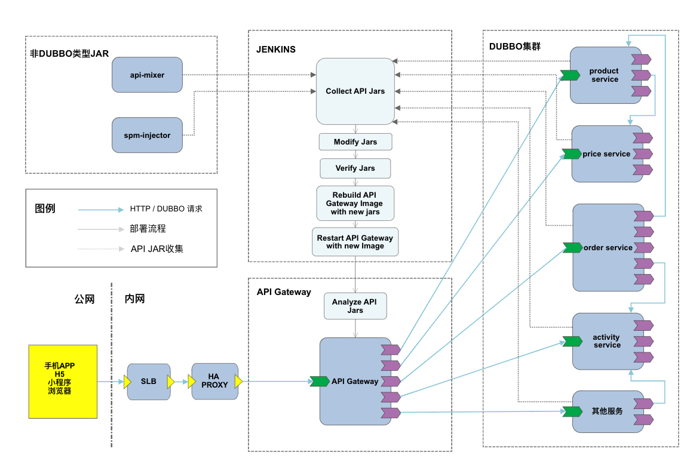

# 1 概述

## 1.1 名词解释

`API`，即应用程序编程接口，一般指系统或框架对外提供的功能，包含通信协议、使用方式、数据格式以及异常处理等。
在本文档中，`API`特指网关所接入的后端微服务集群对前端提供的编程接口。

**`API`具有以下特点：**

* 由后端代码声明
* 在后端逻辑中具备一定的业务意义，能完成特定的功能
* 网关能够检测到后端代码所声明的API
* 网关会针对每个API生成相应的文档和使用这个API的SDK
* 对于后端来说，一个API对应于一个java方法（声明了特定注解的方法）
* 对于前端来说，一个API对应于后端提供的一个功能，能接受特定输入参数，并返回期待的数据、执行相应的操作或返回异常代码

`API-GATEWAY`，又称`API网关`，或简称`网关`（除非特殊说明，本文档中的名词"网关"均指示API-Gateway），
指的是介于后端微服务集群和前端页面（客户端浏览器、app）之间的中间件，用于协调前后端之间的通信协议，
是前端页面访问后端服务的唯一入口。

**网关主要提供以下服务：**

* 将来自前端的 HTTP 请求转换为 DUBBO 请求，并调用相应 DUBBO 服务，以替代前端和后端微服务集群交互
* 对每个HTTP请求提供基础的签名&验签功能
* 对所有前端请求进行身份认证和权限验证（包括自动续签用户token、强制下线用户等）
* 提供语法机制，允许后端开发人员方便灵活地声明需要暴露给网关的API
* 生成实时的API文档
* 生成具备强类型信息的API SDK以方便前端开发人员使用后端所提供的API
* 提供通用的文件上传服务（阿里云OSS、七牛、腾讯视频等）

## 1.2 应用场景

* 后端采用微服务架构，使用DUBBO框架
* 前端使用HTTP和后端交互
* 后端对前端需要有统一的入口
* 使用声明式的强类型API

## 1.3 网关顶层架构图

我们将网关放置于整个系统集群中去理解网关在系统中的位置、扮演的角色以及起到的作用：

> 上图分别讲述了网关的两个阶段，收集API Jar和执行API。部署框架会从所有的DUBBO机器上获取它使用的最新版本的API JAR，以及其他非DUBBO
类的JAR。Jenkins对这些JAR进行一系列处理和校验，并使用这些JAR在网关原有镜像上创建一个新镜像，最终使用这个新镜像重启网关。网关在重启时
从这些JAR中解析出API，并作为后续API执行的依据。
